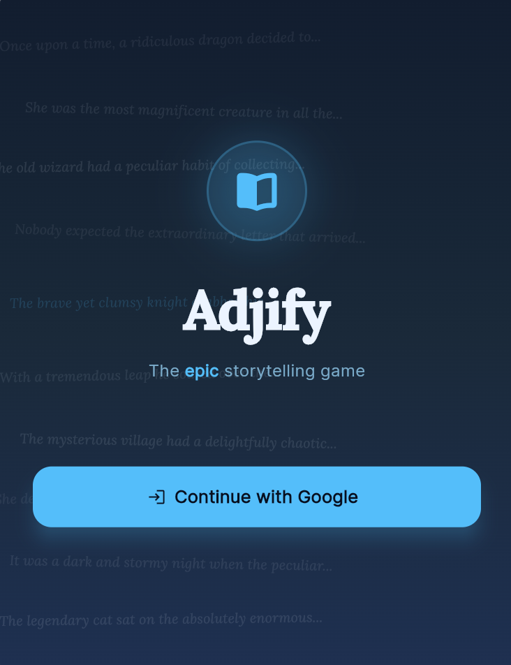
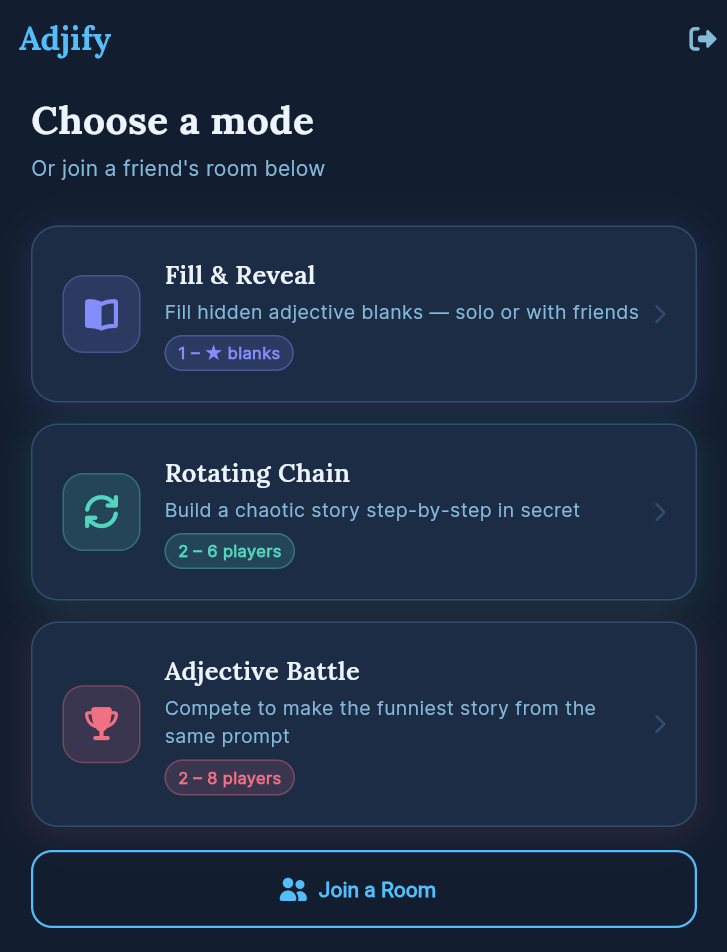

# Adjify

A multiplayer adjective storytelling game where players collaborate or compete to fill in the blanks and build stories together.




## Game modes

- **Fill & Reveal** — A story is shown with `[ADJ]` blanks. Players fill them in, then the completed story is revealed.
- **Rotating Chain** — 3–6 players alternate between writing sentences and filling adjective blanks. The full story is hidden until the end.
- **Adjective Battle** — A master creates a prompt. Everyone fills the blanks and writes a continuation, then the group votes on the best result.

## Tech stack

| Layer | Technology |
|---|---|
| Mobile app | Flutter (Dart) |
| Backend | Node.js + TypeScript + Express + Socket.io |
| Database & Auth | Supabase (PostgreSQL + Google OAuth) |
| Navigation | GoRouter |
| Env config | envied + build_runner |

## Project structure

```
adjify/
├── app/                     # Flutter mobile app
│   └── lib/
│       ├── main.dart        # Entry point, Supabase init
│       ├── router.dart      # GoRouter navigation
│       ├── config/env.dart  # Environment variables
│       ├── models/          # Dart data models
│       ├── screens/         # UI screens
│       ├── services/        # API + socket clients
│       └── widgets/         # Shared UI components
│
├── backend/                 # Node.js + TypeScript server
│   └── src/
│       ├── index.ts         # Express + Socket.io entry point
│       ├── middleware/      # JWT auth (Supabase JWKS)
│       ├── routes/          # REST endpoints
│       ├── services/        # Room, story, chain, battle logic
│       └── types/           # Shared TypeScript types
│
└── supabase/
    └── migrations/
        ├── 001_initial_schema.sql
        └── 002_rpc.sql
```

## Setup

**Prerequisites:** Flutter SDK, Node.js 18+, Supabase project with Google OAuth enabled.

### 1. Environment variables

```bash
cp backend/.env.example backend/.env
cp app/.env.example app/.env
```

Fill in your Supabase URL, anon key, and service role key.

### 2. Backend

```bash
cd backend
npm install
npm run dev
```

### 3. Flutter app

```bash
cd app
flutter pub get
flutter pub run build_runner build
flutter run -d edge --web-port 8080
```

### 4. Database

```bash
supabase db push
```

Enable **Google OAuth** in your Supabase project under Authentication → Providers.
